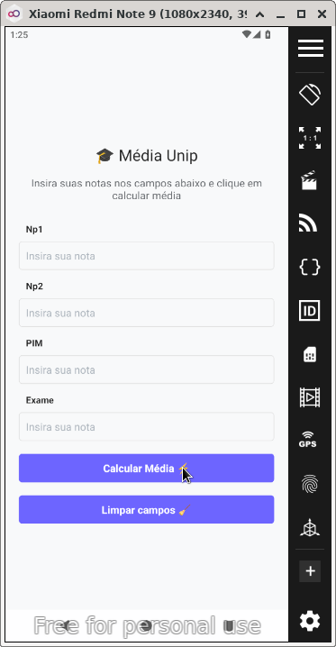
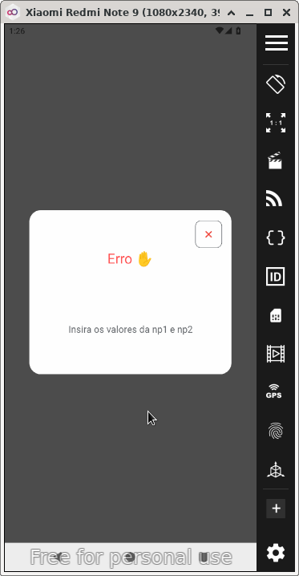
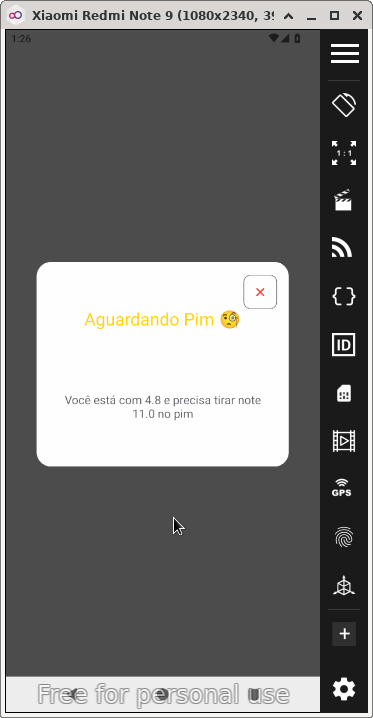
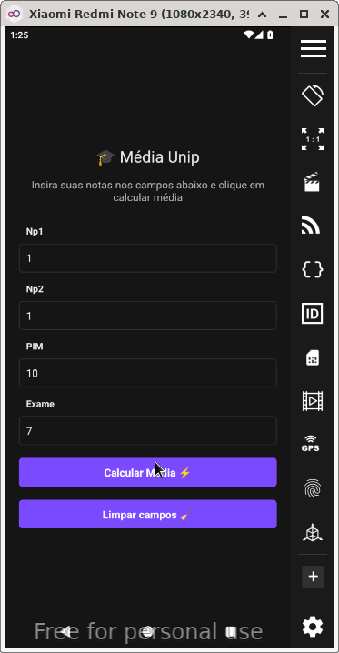
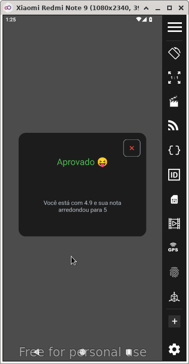

# 📱 Média UNIP

**PT-BR:** Aplicativo para auxiliar estudantes da UNIP a calcular médias semestrais.  
**EN:** App to help UNIP students calculate semester grades.

---

## ✨ Funcionalidades | Features

- 📊 Cálculo automático da média final | Auto average calculation  
- 🎓 Interface simples e intuitiva | Clean and easy UI  
- 📱 Suporte a Android | Android support  

---

## 📸 Capturas de Tela | Screenshots







---
## 🛠️ Tecnologias | Technologies

- React Native  
- Expo  
- TypeScript  

---

## ▶️ Como rodar | How to run

```bash
git clone https://github.com/jgnevess/media-unip
cd media-unip
npm install
npx expo start
```

---

## 📄 Licença | License

Este projeto está licenciado sob a [CC BY-NC 4.0](https://creativecommons.org/licenses/by-nc/4.0/).  
This project is licensed under the [CC BY-NC 4.0](https://creativecommons.org/licenses/by-nc/4.0/).

[](https://creativecommons.org/licenses/by-nc/4.0/)
